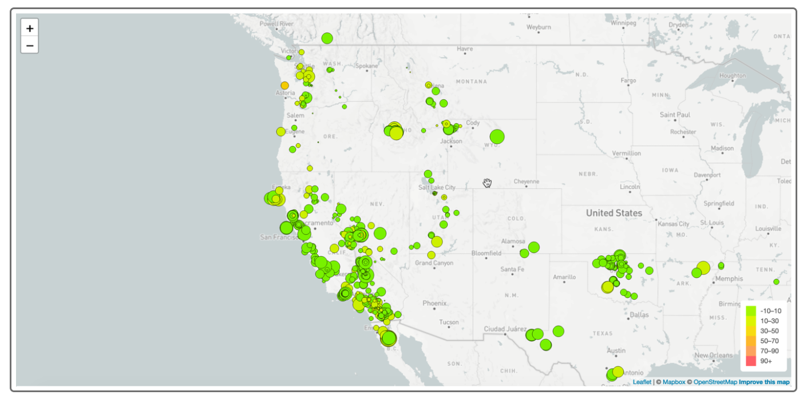

# USGS Earthquake Data Visualization

The goal of this project is to create an interactive map that visualizes earthquake data collected by the United States Geological Survey (USGS). With this visualization, my aim is to better educate the public and government organizations about seismic activity around the world and its impact on our planet.

## Project Structure

In this repository, I have organized the project into two main directories:

- `Leaflet-Part-1`: This directory contains all the files and resources related to Part 1 of the challenge. Here, I'll be focusing on creating the earthquake visualization.

## Getting Started

To get started with the earthquake visualization, I took the following simple steps:

1. I cloned my repository to my local computer

2. After cloning the repository, I navigated to the appropriate directory.

## Dataset

For this visualization, I obtained the earthquake data from the USGS GeoJSON Feed page. They provide regularly updated earthquake data in JSON format. You can choose the dataset you want to visualize from the available options on their website.

## Visualization Features

The earthquake visualization I created comes with some exciting features:

- An interactive map that displays earthquake locations based on their latitude and longitude coordinates.
- Data markers that represent earthquakes with varying sizes, reflecting their magnitudes.
- The color of the markers indicates the depth of each earthquake. Darker colors represent greater depths.
- When you click on a marker, a popup appears, providing additional information about that specific earthquake, such as its magnitude, location, and depth.
- To help you interpret the map, I've included a legend that explains the meaning behind the marker sizes and colors.
